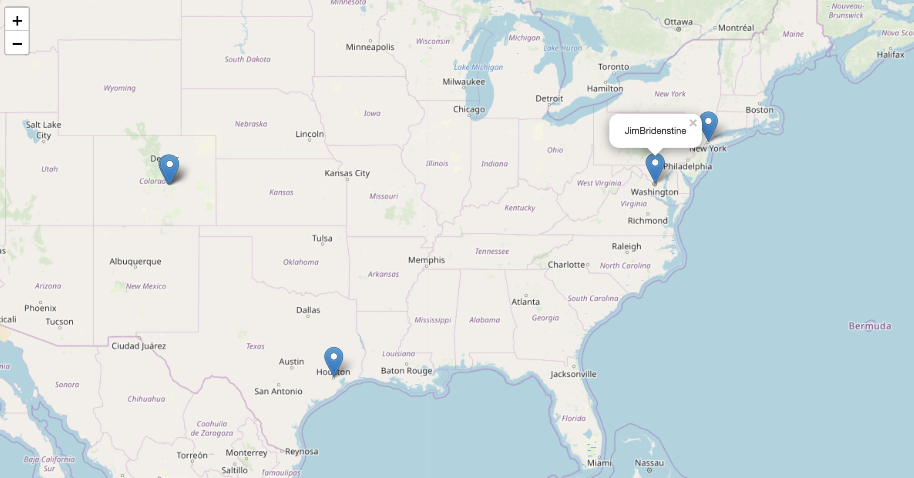

#Describtion
The Twitter App is designed to get the location of user's friends on Twitter.
#How it works:
    1. A user types his/her Twitter @username and presses Enter.
    2. The Web app redirects a user to the map where the friends' locations are shown with markers.
    3. When the user presses the marker it shows his/her friend's screen name.
#Requirements
    pip install folium
    pip install geopy
    pip install requests
    pip install flask
#An example of running the program:
* Serving Flask app "flask_server" (lazy loading)
 * Environment: production
   WARNING: This is a development server. Do not use it in a production deployment.
   Use a production WSGI server instead.
 * Debug mode: on
 * Running on http://127.0.0.1:5003/ (Press CTRL+C to quit)
 * Restarting with stat
 * Debugger is active!
 * Debugger PIN: 159-766-397
 
 
